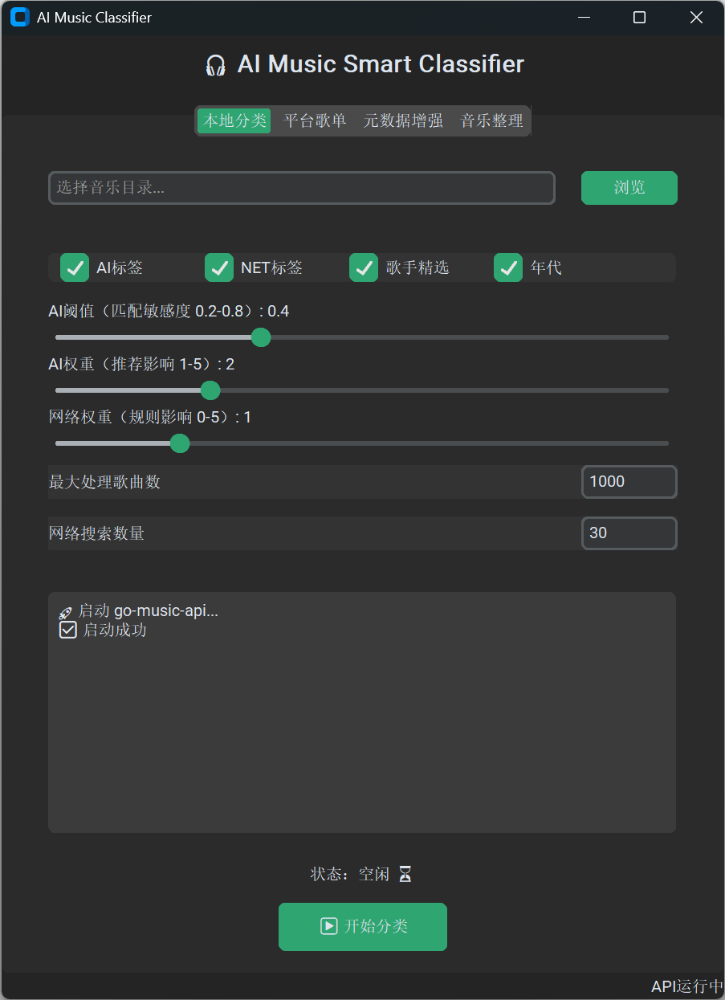
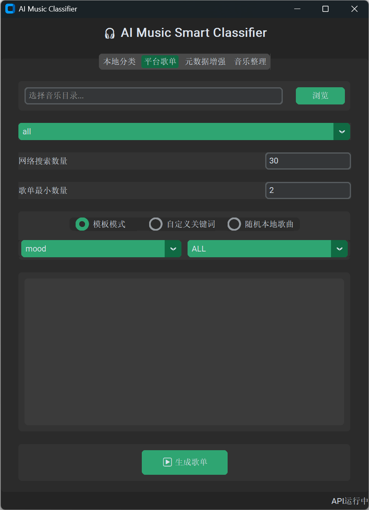
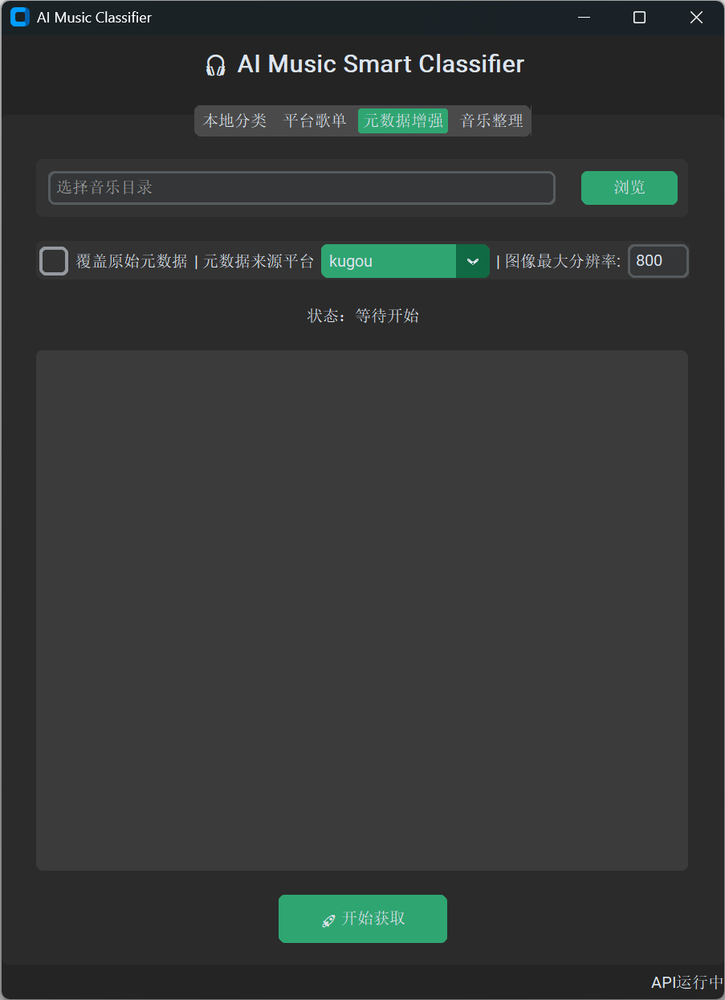
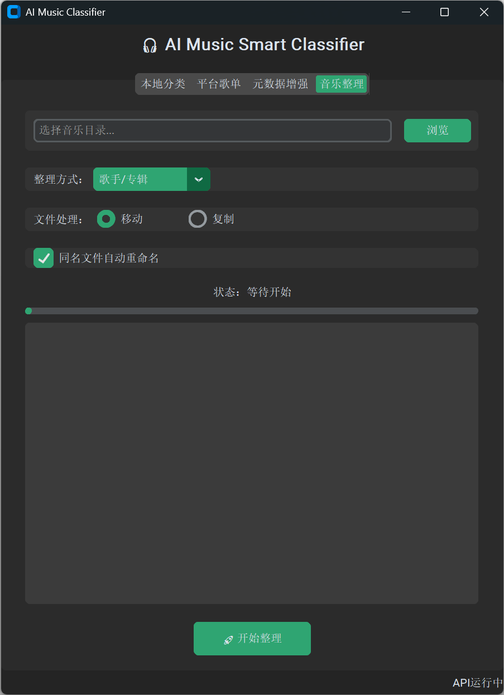

# AI歌单生成器（AI Music Classifier）

## 项目简介

> 一个集 **本地音乐管理、AI 智能分类、网络歌单生成、元数据补全、音乐库整理** 于一体的桌面音乐管理工具。
*基于 Python + AI(sentence-transformers) + CustomTkinter + go-music-api，Vibe Coding*

- 本地AI部署，智能本地音乐分类及权重推荐
- 多平台歌单支持，自动匹配本地歌曲，多钟搜索配置
- 自动生成 M3U 播放列表，包含丰富元数据，兼容各大平台
- 实现多平台推荐与本地收藏融合
- 歌曲元数据增强，自动补全原始文件中缺失的元数据
- 根据歌曲元数据信息自动整理文件结构

主要支持：

- 🎵 本地音乐管理
- 🎧 多类型歌单生成
- 🤖 AI 标签分类
- 🏷️ 元数据增强
- 📂 M3U 歌单导出
- 🔍 多平台支持

## 📋 功能导航

```text
AI Music Playlist Generator

├── 🎧 本地分类
├── 🌐 平台歌单
├── 🏷️ 元数据增强
└── 📁 音乐整理
```


## 🎧 本地分类

### 页面简介

- 功能选择：选择启用的功能，主要功能介绍在[功能简介](#功能简介)中
- AI阈值：配置AI匹配的阈值，域值越大，匹配越精确，匹配到的歌曲会变少
- 权重配置：配置生成歌单中歌曲排序的权重
- 最大处理歌曲数：设置最大处理多少本地歌曲，避免本地歌曲太多导致运行时间长
- 网络搜索量：网络歌单采样数据量

### 功能简介

本地分类页面用于扫描本地音乐库，通过 AI 标签分析、歌词分析、规则匹配以及网络辅助分类，为歌曲自动生成标签和主题歌单。

### 核心功能

### 📂 音乐库扫描

自动递归扫描指定目录下的音乐文件，并根据音质去重，目前优先选择flac文件：

- MP3
- FLAC

自动读取：

- 歌曲名称
- 歌手
- 专辑
- 年份
- 歌词
- 时长

### 🤖 AI 智能分类

基于语义模型自动分析歌曲内容，自动识别歌曲情绪或主题标签：

```text
💔_失恋; 💔_孤独; 😢_悲伤; 😌_治愈; 😊_开心; 🔥_热血; 😎_酷; 🌙_夜晚; 📖_学习; 🚗_车载; 🏃_运动; 🛌_睡眠; 🎉_派对; 🎓_毕业; 💍_爱情; 📼_回忆; 🌌_理想; 🧳_成长; 🌙_夜晚; 📖_学习; 🌿_轻松; 🔥_热血; 🌈_青春
```

### 👨‍🎤 歌手精选

自动生成歌手精选分类歌单，根据权重和命中率排序。

### 📅 年代分类

自动生成年代分类歌单，根据权重和命中率排序。

### 🎼 M3U 歌单导出

自动生成 m3u 格式歌单，具体格式如下：

```
#EXTM3U
#PLAYLIST:NET_🌈_青春
#EXTALB:在我心里有个你
#EXTART:周传雄
#EXTINF:293,周传雄 - 关不上的窗
D:/Work/Personal/MusicC/py_version\关不上的窗 - 周传雄.flac
#EXTALB:最伟大的作品
#EXTART:周杰伦
#EXTINF:244,周杰伦 - 最伟大的作品
D:/Work/Personal/MusicC/py_version\周杰伦\最伟大的作品 - 周杰伦.flac
```

兼容：

- Foobar2000
- VLC
- Kodi
- Jellyfin
- EMBY

## 🌐 平台歌单

### 页面简介

- 网络平台选择：只选择相应平台的歌单
- 网络搜索数量：每一次搜索匹配的网络歌单数量
- 歌单最小数量：本地匹配到的歌曲小于该数量时不生成歌单
- 模式选择：
  - 模板模式：预设关键词搜索
  - 自定义关键词：自定义关键词搜索
  - 随机本地歌曲：随机选择本地歌曲搜索

### 功能简介

利用网络音乐平台热门歌单与本地音乐库进行匹配，快速生成符合网络歌单，匹配本地歌曲。

### 支持平台

| 平台       | Source   |
| ---------- | -------- |
| 网易云音乐 | netease  |
| QQ 音乐    | qq       |
| 酷狗音乐   | kugou    |
| 酷我音乐   | kuwo     |
| 咪咕音乐   | migu     |
| 千千音乐   | qianqian |
| 汽水音乐   | soda     |
| 5sing      | fivesing |
| Jamendo    | jamendo  |
| JOOX       | joox     |

*基于 go-music-api 集成*


### 主要功能

- 网络歌单，本地匹配
- 歌单封面下载
    - 自动获取歌单封面
    - 自动保存封面图片

## 🏷️ 元数据增强

### 页面简介

- 选择是否覆盖源文件中的数据，选择后会重写元数据
- 选择元数据来源平台（*歌曲年份信息统一来自netease*）
- 图像最大分辨率，将大于该分辨率的图片压缩为当前分辨率，以方便不同设备的支持

** 如果原始音乐没有元数据，则文件名必须为`歌手 - 歌曲名`格式

### 功能简介

自动从网络平台获取歌曲信息，并写回本地音频文件，方便不同平台音乐库的创建。

### 支持写入内容

- 基础信息：

```text
标题
歌手
专辑
发布日期
```

- 歌词

自动获取歌词并写入标签，播放器可直接读取嵌入歌词。

- 专辑封面

自动下载专辑封面并写入标签。


### 覆盖策略

- 补全缺失项（推荐）：已有数据保留，缺失数据补全
- 强制覆盖：全部重新写入


## 📁 音乐整理

### 页面简介

- 选择输出目录
- 整理格式：歌手、专辑、歌手/专辑
- 文件处理：移动或者复制到新文件夹

### 功能简介

一键整理本地音乐库目录结构，将混乱的音乐文件自动重命名为`歌手 - 歌曲名`归类到对应目录中。

- 整理前

```text
Music

├── track001.mp3
├── song.flac
├── 周杰伦 稻香.mp3
├── unknown.*lac
```

- 整理后

```text
Music

├── 周杰伦
│   └── 魔杰座
│       └── 稻香.flac
│
├── 陈奕迅
│   └── U87
│       └── 浮夸.flac
```


### 自动重命名

将混乱的音乐文件自动重命名为`歌手 - 歌曲名`

## GUI界面

*基于 CustomTkinter 开发*

### AI歌曲分类



### 网络歌单匹配



### 歌曲元数据增强



### 音乐文件整理



## License

Apache License 2.0

## 现有问题记录

1. 音乐年份获取统一使用netease源
2. 部分歌曲歌词不好获取
